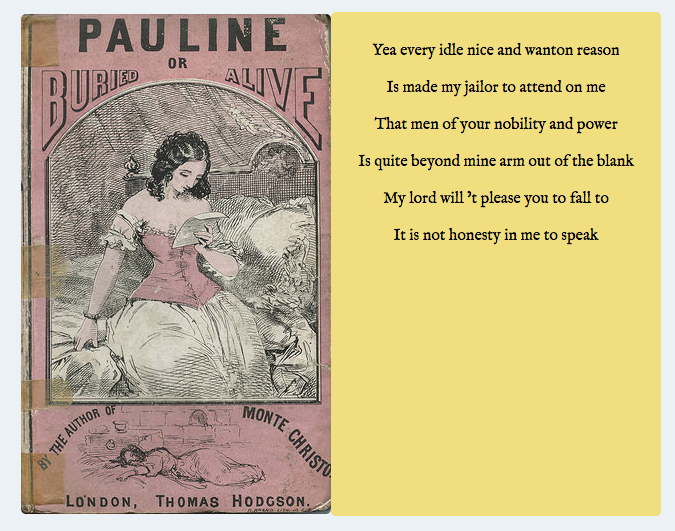

# William Shakespeare Summarizes Everything

What if Shakespeare wrote the backs of 19th-century book jackets? For NaNoGenMo 2017, I matched randomized lines from [Shakespeare's works](http://www.folgerdigitaltexts.org/) with [Yellowback book covers](https://www.flickr.com/photos/yellowbacks/).

To run this code, you'll need your own API key and API secret from Flickr. The Python script creates a markdown file that I converted to HTML and, with some adjustments and styles, posted [here](http://jrladd.com/shakes_summary).

This is inspired by Stephen Pentecost's [Mutable Stanzas](http://montaukedp.com/apps/mutableStanzas/) and Kate Beaton's [Gorey book covers](http://www.harkavagrant.com/index.php?id=242). I wanted to make a project that plays with the way our minds fill in the gaps between text and image, as well as between lines that weren't intended to be together. The result is nonsense that makes sense despite itself.

